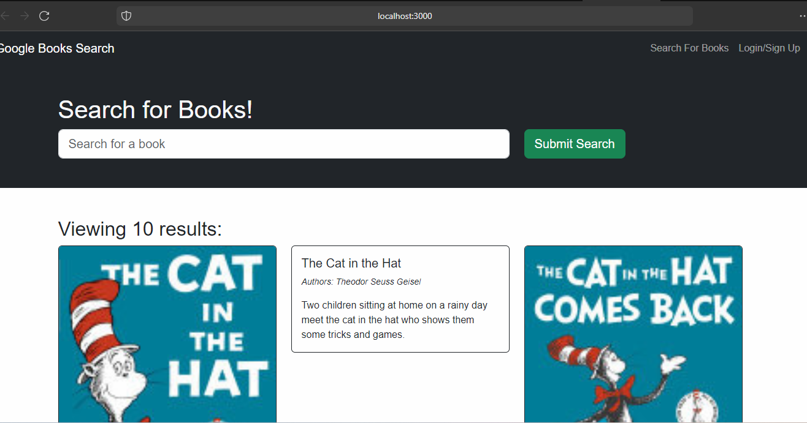

# 21 MERN: Book Search Engine

## Description

Your assignment this week is emblematic of the fact that most modern websites are driven by two things: data and user demands. This shouldn't come as a surprise, as the ability to personalize user data is the cornerstone of real-world web development today. And as user demands evolve, applications need to be more performant.

This week, you’ll take starter code with a fully functioning Google Books API search engine built with a RESTful API, and refactor it to be a GraphQL API built with Apollo Server. The app was built using the MERN stack with a React front end, MongoDB database, and Node.js/Express.js server and API. It's already set up to allow users to save book searches to the back end.

To complete the assignment, you’ll need to do the following:

1. Set up an Apollo Server to use GraphQL queries and mutations to fetch and modify data, replacing the existing RESTful API.

2. Modify the existing authentication middleware so that it works in the context of a GraphQL API.

3. Create an Apollo Provider so that requests can communicate with an Apollo Server.

4. Deploy your application to Render with a MongoDB database using MongoDB Atlas. Use the [Deploy with Render and MongoDB Atlas](https://coding-boot-camp.github.io/full-stack/mongodb/deploy-with-render-and-mongodb-atlas) walkthrough for instructions.

## User Story

```md
AS AN avid reader
I WANT to search for new books to read
SO THAT I can keep a list of books to purchase
```

## Acceptance Criteria

```md
GIVEN a book search engine
WHEN I load the search engine
THEN I am presented with a menu with the options Search for Books and Login/Signup and an input field to search for books and a submit button
WHEN I click on the Search for Books menu option
THEN I am presented with an input field to search for books and a submit button
WHEN I am not logged in and enter a search term in the input field and click the submit button
THEN I am presented with several search results, each featuring a book’s title, author, description, image, and a link to that book on the Google Books site
WHEN I click on the Login/Signup menu option
THEN a modal appears on the screen with a toggle between the option to log in or sign up
WHEN the toggle is set to Signup
THEN I am presented with three inputs for a username, an email address, and a password, and a signup button
WHEN the toggle is set to Login
THEN I am presented with two inputs for an email address and a password and login button
WHEN I enter a valid email address and create a password and click on the signup button
THEN my user account is created and I am logged in to the site
WHEN I enter my account’s email address and password and click on the login button
THEN I the modal closes and I am logged in to the site
WHEN I am logged in to the site
THEN the menu options change to Search for Books, an option to see my saved books, and Logout
WHEN I am logged in and enter a search term in the input field and click the submit button
THEN I am presented with several search results, each featuring a book’s title, author, description, image, and a link to that book on the Google Books site and a button to save a book to my account
WHEN I click on the Save button on a book
THEN that book’s information is saved to my account
WHEN I click on the option to see my saved books
THEN I am presented with all of the books I have saved to my account, each featuring the book’s title, author, description, image, and a link to that book on the Google Books site and a button to remove a book from my account
WHEN I click on the Remove button on a book
THEN that book is deleted from my saved books list
WHEN I click on the Logout button
THEN I am logged out of the site and presented with a menu with the options Search for Books and Login/Signup and an input field to search for books and a submit button  
```

## Mock-Up

The following screenshot shows the web application's appearance and functionality:

```md

```

## Motivation

I was motivated to complete this assignment to learn more about the popular technology architecture known as MERN stack: front end, back end, and database using GraphQL, Apollo server, JavaScript and JSON. MERN stands for MongoDB, Express, React, Node, after the four key technologies that make up the stack.

This inlcudes the use of MongoDB Atlas, a multi-cloud database service by the same people that build MongoDB. Atlas simplifies deploying and managing your databases while offering the versatility you need to build resilient and performant global applications on the cloud providers of your choice.

## Why

I created this project because I wanted to challenge myself in becoming a full stack developer. I wanted to learn more about the MERN stack and how to use it to create a full stack application that uses GraphQL and apollow server. Like any web stack, you can build whatever you want in MERN — though it’s ideally suited for cases that are JSON-heavy, cloud-native, and that have dynamic web interfaces.

Examples include workflow management, news aggregation, to-do apps and calendars, and interactive forums/social products — and whatever else you can dream up!

## What problem does it solve?

This project solves the problem of creating a slow and heavy load on the server as would be the case with a RESTful API. By Integrating GraphQL and apollo server into a MERN (MongoDB, Express.js, React, Node.js) stack application, where MongoDB Atlas is used as the database, leveraging MongoDB Atlas as my database with cloud accessability. This setup allows you to use GraphQL's powerful data querying and manipulation capabilities, which can be more efficient and flexible than traditional REST APIs, seamless integration with MERN stack.

## What did you learn?

I learned how to use GraphQL and apollo server to query and manipulate data, streamlining data fetching and management, reducing the requests on the server and increasing speed. This inlcudes a strongly typed API with schema validation, state management in client applications, and enhanced security with controlled data access. I learned MongoDB works extremely well with Node.js, and makes storing, manipulating, and representing JSON data at every tier of your application incredibly easy. For cloud-native applications.
MongoDB Atlas makes it even easier, by giving you an auto-scaling MongoDB cluster on the cloud provider of your choice, as easy as a few button clicks. learned how to deploy a MERN stack application to render, and netlify.

## What makes your project stand out?

My project stands out because it uses GraphQL, apollo server, MERN stack, MongoDB Atlas with cloud accessability, and is deployed on render, and netlify. Incorporating Apollo Server and GraphQL into a MERN stack application with MongoDB Atlas provides a robust, efficient, and developer-friendly environment. It enhances the application's scalability, maintainability, and performance, making it a compelling choice for modern web application development.

## Installation

first type npm install in the terminal, then npm run develop in the terminal to start the server.

## Usage

You can use this web application to login as a user then search for books, save the books you have searched for, and delete books books you have searched for.

```md

```

### Link to github repo

<https://github.com/precisecoding/Book-Search-Engine>

### Deployed link

Deployed on render.com:
<https://book-search-engine-s445.onrender.com>

Deployed on netlify:
[booksearchengine4dubtcmp.netlify.app, netlify link](https://booksearchengine4dubtcmp.netlify.app)

### This site was built using netlify and render

Render:
<https://render.com/>

Netlify:
<https://netlify.com>

MongoDB Atlas:
<https://www.mongodb.com/atlas/database>

Apollo Server/GraphQL:
<https://www.apollographql.com/docs/react/>

### License

MIT License:
<https://opensource.org/licenses/MIT>
<https://choosealicense.com/licenses/mit/>
LICENSE file included in repository.

### Thanks to everyone for support and contributions

Sources used: <https://developer.mozilla.org/en-US/>, <https://www.w3schools.com/>, <https://stackoverflow.com/>. Worked with TA George Yoo while on writing the pseudo code, once again he was very helpful.
